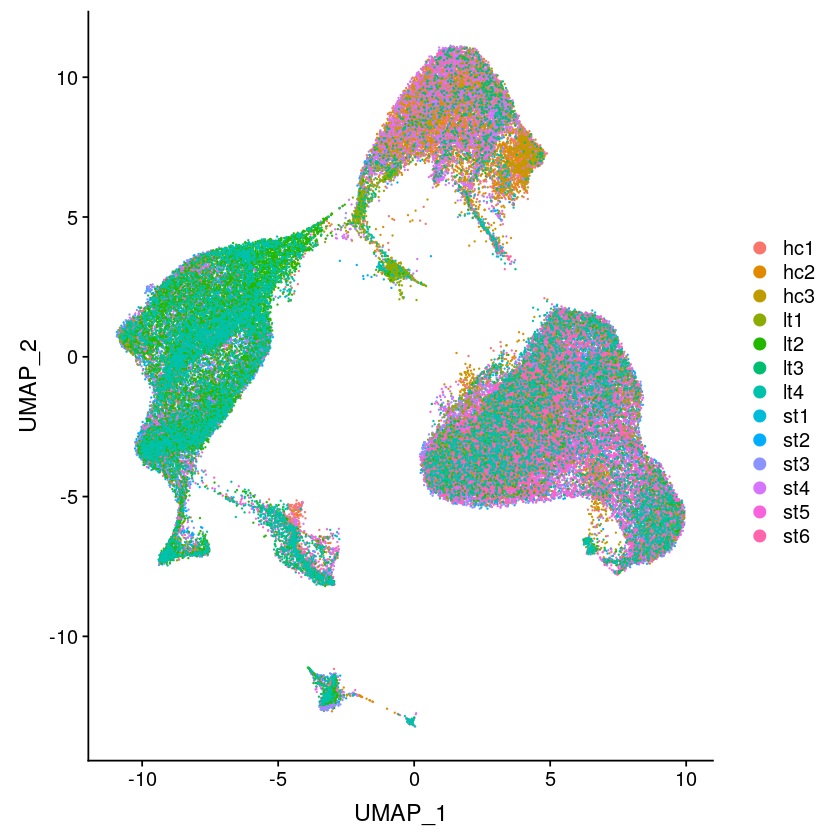
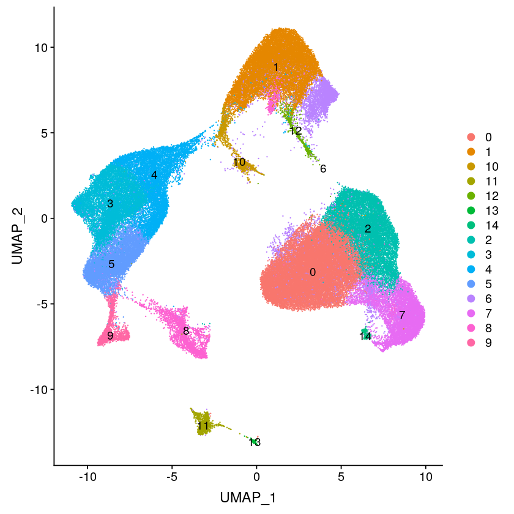
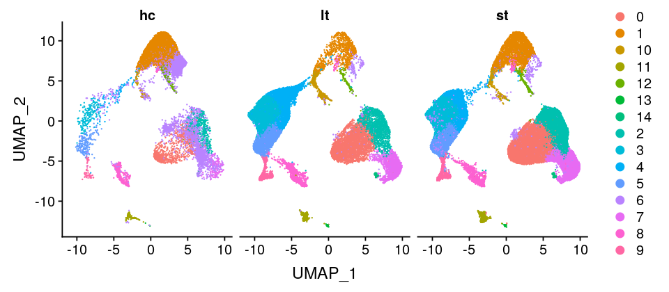

```R
#devtools::install_github('satijalab/seurat-data'
library(Seurat)
library(dplyr)
```

    
    Attaching package: ‘dplyr’
    
    The following objects are masked from ‘package:stats’:
    
        filter, lag
    
    The following objects are masked from ‘package:base’:
    
        intersect, setdiff, setequal, union
    


```R
# Read in dataset (health control, hc)
hc1.data <- Read10X(data.dir = "../data/GSE130888_RAW/GSM3755693/")
hc2.data <- Read10X(data.dir = "../data/GSE130888_RAW/GSM3755694/")
hc3.data <- Read10X(data.dir = "../data/GSE130888_RAW/GSM3755695/")

hc1 <- CreateSeuratObject(counts = hc1.data, project = "hc1", min.cells = 3, min.features = 200)
hc2 <- CreateSeuratObject(counts = hc2.data, project = "hc2", min.cells = 3, min.features = 200)
hc3 <- CreateSeuratObject(counts = hc3.data, project = "hc3", min.cells = 3, min.features = 200)

hc1[["percent.mt"]] <- PercentageFeatureSet(hc1, pattern = "^MT-")
hc2[["percent.mt"]] <- PercentageFeatureSet(hc2, pattern = "^MT-")
hc3[["percent.mt"]] <- PercentageFeatureSet(hc3, pattern = "^MT-")

hc1 <- subset(hc1, subset = nFeature_RNA > 200 & nFeature_RNA < 4000 & percent.mt < 10)
hc2 <- subset(hc2, subset = nFeature_RNA > 200 & nFeature_RNA < 4000 & percent.mt < 10)
hc3 <- subset(hc3, subset = nFeature_RNA > 200 & nFeature_RNA < 4000 & percent.mt < 10)
```

    Warning message:
    “Feature names cannot have underscores ('_'), replacing with dashes ('-')”Warning message:
    “Feature names cannot have underscores ('_'), replacing with dashes ('-')”Warning message:
    “Feature names cannot have underscores ('_'), replacing with dashes ('-')”


```R
# Read in dataset (short term, st) 
st1.data <- Read10X(data.dir = "../data/GSE130888_RAW/GSM3755687")
st2.data <- Read10X(data.dir = "../data/GSE130888_RAW/GSM3755688/")
st3.data <- Read10X(data.dir = "../data/GSE130888_RAW/GSM3755689/")
st4.data <- Read10X(data.dir = "../data/GSE130888_RAW/GSM3755690/")
st5.data <- Read10X(data.dir = "../data/GSE130888_RAW/GSM3755691/")
st6.data <- Read10X(data.dir = "../data/GSE130888_RAW/GSM3755692/")

st1 <- CreateSeuratObject(counts = st1.data, project = "st1", min.cells = 3, min.features = 200)
st2 <- CreateSeuratObject(counts = st2.data, project = "st2", min.cells = 3, min.features = 200)
st3 <- CreateSeuratObject(counts = st3.data, project = "st3", min.cells = 3, min.features = 200)
st4 <- CreateSeuratObject(counts = st4.data, project = "st4", min.cells = 3, min.features = 200)
st5 <- CreateSeuratObject(counts = st5.data, project = "st5", min.cells = 3, min.features = 200)
st6 <- CreateSeuratObject(counts = st6.data, project = "st6", min.cells = 3, min.features = 200)

st1[["percent.mt"]] <- PercentageFeatureSet(st1, pattern = "^MT-")
st2[["percent.mt"]] <- PercentageFeatureSet(st2, pattern = "^MT-")
st3[["percent.mt"]] <- PercentageFeatureSet(st3, pattern = "^MT-")
st4[["percent.mt"]] <- PercentageFeatureSet(st4, pattern = "^MT-")
st5[["percent.mt"]] <- PercentageFeatureSet(st5, pattern = "^MT-")
st6[["percent.mt"]] <- PercentageFeatureSet(st6, pattern = "^MT-")

st1 <- subset(st1, subset = nFeature_RNA > 200 & nFeature_RNA < 4000 & percent.mt < 10)
st2 <- subset(st2, subset = nFeature_RNA > 200 & nFeature_RNA < 4000 & percent.mt < 10)
st3 <- subset(st3, subset = nFeature_RNA > 200 & nFeature_RNA < 4000 & percent.mt < 10)
st4 <- subset(st4, subset = nFeature_RNA > 200 & nFeature_RNA < 4000 & percent.mt < 10)
st5 <- subset(st5, subset = nFeature_RNA > 200 & nFeature_RNA < 4000 & percent.mt < 10)
st6 <- subset(st6, subset = nFeature_RNA > 200 & nFeature_RNA < 4000 & percent.mt < 10)
```

    Warning message:
    “Feature names cannot have underscores ('_'), replacing with dashes ('-')”Warning message:
    “Feature names cannot have underscores ('_'), replacing with dashes ('-')”Warning message:
    “Feature names cannot have underscores ('_'), replacing with dashes ('-')”Warning message:
    “Feature names cannot have underscores ('_'), replacing with dashes ('-')”Warning message:
    “Feature names cannot have underscores ('_'), replacing with dashes ('-')”Warning message:
    “Feature names cannot have underscores ('_'), replacing with dashes ('-')”


```R
# Read in dataset (long term, lt) 
lt1.data <- Read10X(data.dir = "../data/GSE130888_RAW/GSM3755696")
lt2.data <- Read10X(data.dir = "../data/GSE130888_RAW/GSM3755697/")
lt3.data <- Read10X(data.dir = "../data/GSE130888_RAW/GSM3755698/")
lt4.data <- Read10X(data.dir = "../data/GSE130888_RAW/GSM3755699/")

lt1 <- CreateSeuratObject(counts = lt1.data, project = "lt1", min.cells = 3, min.features = 200)
lt2 <- CreateSeuratObject(counts = lt2.data, project = "lt2", min.cells = 3, min.features = 200)
lt3 <- CreateSeuratObject(counts = lt3.data, project = "lt3", min.cells = 3, min.features = 200)
lt4 <- CreateSeuratObject(counts = lt4.data, project = "lt4", min.cells = 3, min.features = 200)

lt1[["percent.mt"]] <- PercentageFeatureSet(lt1, pattern = "^MT-")
lt2[["percent.mt"]] <- PercentageFeatureSet(lt2, pattern = "^MT-")
lt3[["percent.mt"]] <- PercentageFeatureSet(lt3, pattern = "^MT-")
lt4[["percent.mt"]] <- PercentageFeatureSet(lt4, pattern = "^MT-")

lt1 <- subset(lt1, subset = nFeature_RNA > 200 & nFeature_RNA < 4000 & percent.mt < 10)
lt2 <- subset(lt2, subset = nFeature_RNA > 200 & nFeature_RNA < 4000 & percent.mt < 10)
lt3 <- subset(lt3, subset = nFeature_RNA > 200 & nFeature_RNA < 4000 & percent.mt < 10)
lt4 <- subset(lt4, subset = nFeature_RNA > 200 & nFeature_RNA < 4000 & percent.mt < 10)
```

    Warning message:
    “Feature names cannot have underscores ('_'), replacing with dashes ('-')”Warning message:
    “Feature names cannot have underscores ('_'), replacing with dashes ('-')”Warning message:
    “Feature names cannot have underscores ('_'), replacing with dashes ('-')”Warning message:
    “Feature names cannot have underscores ('_'), replacing with dashes ('-')”


```R
pd.list = c(hc1,hc2,hc3,st1,st2,st3,st4,st5,st6,lt1,lt2,lt3,lt4)
for (i in 1:length(x = pd.list)) {
    pd.list[[i]] <- NormalizeData(object = pd.list[[i]], verbose = FALSE)
    pd.list[[i]] <- FindVariableFeatures(object = pd.list[[i]], selection.method = "vst", nfeatures = 2000, verbose = FALSE)
}
```


```R
# find anchors for integration using CCA algorithm.
pd.anchors <- FindIntegrationAnchors(object.list = pd.list, dims = 1:30)
```

    Warning message in CheckDuplicateCellNames(object.list = object.list):
    “Some cell names are duplicated across objects provided. Renaming to enforce unique cell names.”Computing 2000 integration features
    Scaling features for provided objects
    Finding all pairwise anchors
    Running CCA
    Merging objects
    Finding neighborhoods
    Finding anchors
    	Found 12841 anchors
    Filtering anchors
    	Retained 3687 anchors
    Extracting within-dataset neighbors
    Running CCA
    Merging objects
    Finding neighborhoods
    Finding anchors
    	Found 10412 anchors
    Filtering anchors
    	Retained 4177 anchors
    Extracting within-dataset neighbors
    Running CCA
    Merging objects
    Finding neighborhoods
    Finding anchors
    	Found 9228 anchors
    Filtering anchors
    	Retained 4506 anchors
    Extracting within-dataset neighbors
    Running CCA
    Merging objects
    Finding neighborhoods
    Finding anchors
    	Found 20908 anchors
    Filtering anchors
    	Retained 1647 anchors
    Extracting within-dataset neighbors
    Running CCA
    Merging objects
    Finding neighborhoods
    Finding anchors
    	Found 13972 anchors
    Filtering anchors
    	Retained 2839 anchors
    Extracting within-dataset neighbors
    Running CCA
    Merging objects
    Finding neighborhoods
    Finding anchors
    	Found 12799 anchors
    Filtering anchors
    	Retained 1949 anchors
    Extracting within-dataset neighbors
    Running CCA
    Merging objects
    Finding neighborhoods
    Finding anchors
    	Found 20088 anchors
    Filtering anchors
    	Retained 1245 anchors
    Extracting within-dataset neighbors
    Running CCA
    Merging objects
    Finding neighborhoods
    Finding anchors
    	Found 13115 anchors
    Filtering anchors
    	Retained 2273 anchors
    Extracting within-dataset neighbors
    Running CCA
    Merging objects
    Finding neighborhoods
    Finding anchors
    	Found 12126 anchors
    Filtering anchors
    	Retained 1660 anchors
    Extracting within-dataset neighbors
    Running CCA
    Merging objects
    Finding neighborhoods
    Finding anchors
    	Found 15760 anchors
    Filtering anchors
    	Retained 5554 anchors
    Extracting within-dataset neighbors
    Running CCA
    Merging objects
    Finding neighborhoods
    Finding anchors
    	Found 19310 anchors
    Filtering anchors
    	Retained 988 anchors
    Extracting within-dataset neighbors
    Running CCA
    Merging objects
    Finding neighborhoods
    Finding anchors
    	Found 12608 anchors
    Filtering anchors
    	Retained 2196 anchors
    Extracting within-dataset neighbors
    Running CCA
    Merging objects
    Finding neighborhoods
    Finding anchors
    	Found 11429 anchors
    Filtering anchors
    	Retained 1636 anchors
    Extracting within-dataset neighbors
    Running CCA
    Merging objects
    Finding neighborhoods
    Finding anchors
    	Found 17688 anchors
    Filtering anchors
    	Retained 6843 anchors
    Extracting within-dataset neighbors
    Running CCA
    Merging objects
    Finding neighborhoods
    Finding anchors
    	Found 19501 anchors
    Filtering anchors
    	Retained 8600 anchors
    Extracting within-dataset neighbors
    Running CCA
    Merging objects
    Finding neighborhoods
    Finding anchors
    	Found 18274 anchors
    Filtering anchors
    	Retained 2410 anchors
    Extracting within-dataset neighbors
    Running CCA
    Merging objects
    Finding neighborhoods
    Finding anchors
    	Found 12749 anchors
    Filtering anchors
    	Retained 2890 anchors
    Extracting within-dataset neighbors
    Running CCA
    Merging objects
    Finding neighborhoods
    Finding anchors
    	Found 11569 anchors
    Filtering anchors
    	Retained 2287 anchors
    Extracting within-dataset neighbors
    Running CCA
    Merging objects
    Finding neighborhoods
    Finding anchors
    	Found 18644 anchors
    Filtering anchors
    	Retained 4613 anchors
    Extracting within-dataset neighbors
    Running CCA
    Merging objects
    Finding neighborhoods
    Finding anchors
    	Found 16051 anchors
    Filtering anchors
    	Retained 4041 anchors
    Extracting within-dataset neighbors
    Running CCA
    Merging objects
    Finding neighborhoods
    Finding anchors
    	Found 15557 anchors
    Filtering anchors
    	Retained 5122 anchors
    Extracting within-dataset neighbors
    Running CCA
    Merging objects
    Finding neighborhoods
    Finding anchors
    	Found 22056 anchors
    Filtering anchors
    	Retained 1387 anchors
    Extracting within-dataset neighbors
    Running CCA
    Merging objects
    Finding neighborhoods
    Finding anchors
    	Found 14464 anchors
    Filtering anchors
    	Retained 2399 anchors
    Extracting within-dataset neighbors
    Running CCA
    Merging objects
    Finding neighborhoods
    Finding anchors
    	Found 12516 anchors
    Filtering anchors
    	Retained 1655 anchors
    Extracting within-dataset neighbors
    Running CCA
    Merging objects
    Finding neighborhoods
    Finding anchors
    	Found 21585 anchors
    Filtering anchors
    	Retained 7278 anchors
    Extracting within-dataset neighbors
    Running CCA
    Merging objects
    Finding neighborhoods
    Finding anchors
    	Found 17328 anchors
    Filtering anchors
    	Retained 6101 anchors
    Extracting within-dataset neighbors
    Running CCA
    Merging objects
    Finding neighborhoods
    Finding anchors
    	Found 19304 anchors
    Filtering anchors
    	Retained 7787 anchors
    Extracting within-dataset neighbors
    Running CCA
    Merging objects
    Finding neighborhoods
    Finding anchors
    	Found 18847 anchors
    Filtering anchors
    	Retained 5185 anchors
    Extracting within-dataset neighbors
    Running CCA
    Merging objects
    Finding neighborhoods
    Finding anchors
    	Found 21869 anchors
    Filtering anchors
    	Retained 783 anchors
    Extracting within-dataset neighbors
    Running CCA
    Merging objects
    Finding neighborhoods
    Finding anchors
    	Found 14231 anchors
    Filtering anchors
    	Retained 1904 anchors
    Extracting within-dataset neighbors
    Running CCA
    Merging objects
    Finding neighborhoods
    Finding anchors
    	Found 12888 anchors
    Filtering anchors
    	Retained 1476 anchors
    Extracting within-dataset neighbors
    Running CCA
    Merging objects
    Finding neighborhoods
    Finding anchors
    	Found 21875 anchors
    Filtering anchors
    	Retained 6146 anchors
    Extracting within-dataset neighbors
    Running CCA
    Merging objects
    Finding neighborhoods
    Finding anchors
    	Found 19003 anchors
    Filtering anchors
    	Retained 3712 anchors
    Extracting within-dataset neighbors
    Running CCA
    Merging objects
    Finding neighborhoods
    Finding anchors
    	Found 19096 anchors
    Filtering anchors
    	Retained 4808 anchors
    Extracting within-dataset neighbors
    Running CCA
    Merging objects
    Finding neighborhoods
    Finding anchors
    	Found 18414 anchors
    Filtering anchors
    	Retained 4793 anchors
    Extracting within-dataset neighbors
    Running CCA
    Merging objects
    Finding neighborhoods
    Finding anchors
    	Found 22192 anchors
    Filtering anchors
    	Retained 5148 anchors
    Extracting within-dataset neighbors
    Running CCA
    Merging objects
    Finding neighborhoods
    Finding anchors
    	Found 11585 anchors
    Filtering anchors
    	Retained 1488 anchors
    Extracting within-dataset neighbors
    Running CCA
    Merging objects
    Finding neighborhoods
    Finding anchors
    	Found 8408 anchors
    Filtering anchors
    	Retained 2526 anchors
    Extracting within-dataset neighbors
    Running CCA
    Merging objects
    Finding neighborhoods
    Finding anchors
    	Found 8034 anchors
    Filtering anchors
    	Retained 2100 anchors
    Extracting within-dataset neighbors
    Running CCA
    Merging objects
    Finding neighborhoods
    Finding anchors
    	Found 10387 anchors
    Filtering anchors
    	Retained 4714 anchors
    Extracting within-dataset neighbors
    Running CCA
    Merging objects
    Finding neighborhoods
    Finding anchors
    	Found 10305 anchors
    Filtering anchors
    	Retained 5007 anchors
    Extracting within-dataset neighbors
    Running CCA
    Merging objects
    Finding neighborhoods
    Finding anchors
    	Found 10772 anchors
    Filtering anchors
    	Retained 5495 anchors
    Extracting within-dataset neighbors
    Running CCA
    Merging objects
    Finding neighborhoods
    Finding anchors
    	Found 10492 anchors
    Filtering anchors
    	Retained 4247 anchors
    Extracting within-dataset neighbors
    Running CCA
    Merging objects
    Finding neighborhoods
    Finding anchors
    	Found 10879 anchors
    Filtering anchors
    	Retained 4901 anchors
    Extracting within-dataset neighbors
    Running CCA
    Merging objects
    Finding neighborhoods
    Finding anchors
    	Found 10643 anchors
    Filtering anchors
    	Retained 3702 anchors
    Extracting within-dataset neighbors
    Running CCA
    Merging objects
    Finding neighborhoods
    Finding anchors
    	Found 22720 anchors
    Filtering anchors
    	Retained 1574 anchors
    Extracting within-dataset neighbors
    Running CCA
    Merging objects
    Finding neighborhoods
    Finding anchors
    	Found 15102 anchors
    Filtering anchors
    	Retained 1504 anchors
    Extracting within-dataset neighbors
    Running CCA
    Merging objects
    Finding neighborhoods
    Finding anchors
    	Found 13466 anchors
    Filtering anchors
    	Retained 864 anchors
    Extracting within-dataset neighbors
    Running CCA
    Merging objects
    Finding neighborhoods
    Finding anchors
    	Found 20554 anchors
    Filtering anchors
    	Retained 2947 anchors
    Extracting within-dataset neighbors
    Running CCA
    Merging objects
    Finding neighborhoods
    Finding anchors
    	Found 20811 anchors
    Filtering anchors
    	Retained 4939 anchors
    Extracting within-dataset neighbors
    Running CCA
    Merging objects
    Finding neighborhoods
    Finding anchors
    	Found 18643 anchors
    Filtering anchors
    	Retained 4737 anchors
    Extracting within-dataset neighbors
    Running CCA
    Merging objects
    Finding neighborhoods
    Finding anchors
    	Found 19494 anchors
    Filtering anchors
    	Retained 2280 anchors
    Extracting within-dataset neighbors
    Running CCA
    Merging objects
    Finding neighborhoods
    Finding anchors
    	Found 18791 anchors
    Filtering anchors
    	Retained 4021 anchors
    Extracting within-dataset neighbors
    Running CCA
    Merging objects
    Finding neighborhoods
    Finding anchors
    	Found 22736 anchors
    Filtering anchors
    	Retained 1916 anchors
    Extracting within-dataset neighbors
    Running CCA
    Merging objects
    Finding neighborhoods
    Finding anchors
    	Found 10130 anchors
    Filtering anchors
    	Retained 2896 anchors
    Extracting within-dataset neighbors
    Running CCA
    Merging objects
    Finding neighborhoods
    Finding anchors
    	Found 9506 anchors
    Filtering anchors
    	Retained 1904 anchors
    Extracting within-dataset neighbors
    Running CCA
    Merging objects
    Finding neighborhoods
    Finding anchors
    	Found 7124 anchors
    Filtering anchors
    	Retained 3429 anchors
    Extracting within-dataset neighbors
    Running CCA
    Merging objects
    Finding neighborhoods
    Finding anchors
    	Found 7002 anchors
    Filtering anchors
    	Retained 2606 anchors
    Extracting within-dataset neighbors
    Running CCA
    Merging objects
    Finding neighborhoods
    Finding anchors
    	Found 8481 anchors
    Filtering anchors
    	Retained 5138 anchors
    Extracting within-dataset neighbors
    Running CCA
    Merging objects
    Finding neighborhoods
    Finding anchors
    	Found 8282 anchors
    Filtering anchors
    	Retained 5214 anchors
    Extracting within-dataset neighbors
    Running CCA
    Merging objects
    Finding neighborhoods
    Finding anchors
    	Found 8613 anchors
    Filtering anchors
    	Retained 5714 anchors
    Extracting within-dataset neighbors
    Running CCA
    Merging objects
    Finding neighborhoods
    Finding anchors
    	Found 9669 anchors
    Filtering anchors
    	Retained 6167 anchors
    Extracting within-dataset neighbors
    Running CCA
    Merging objects
    Finding neighborhoods
    Finding anchors
    	Found 9021 anchors
    Filtering anchors
    	Retained 5871 anchors
    Extracting within-dataset neighbors
    Running CCA
    Merging objects
    Finding neighborhoods
    Finding anchors
    	Found 8456 anchors
    Filtering anchors
    	Retained 5025 anchors
    Extracting within-dataset neighbors
    Running CCA
    Merging objects
    Finding neighborhoods
    Finding anchors
    	Found 6983 anchors
    Filtering anchors
    	Retained 4965 anchors
    Extracting within-dataset neighbors
    Running CCA
    Merging objects
    Finding neighborhoods
    Finding anchors
    	Found 8272 anchors
    Filtering anchors
    	Retained 3649 anchors
    Extracting within-dataset neighbors
    Running CCA
    Merging objects
    Finding neighborhoods
    Finding anchors
    	Found 19491 anchors
    Filtering anchors
    	Retained 1900 anchors
    Extracting within-dataset neighbors
    Running CCA
    Merging objects
    Finding neighborhoods
    Finding anchors
    	Found 13562 anchors
    Filtering anchors
    	Retained 2260 anchors
    Extracting within-dataset neighbors
    Running CCA
    Merging objects
    Finding neighborhoods
    Finding anchors
    	Found 11926 anchors
    Filtering anchors
    	Retained 1514 anchors
    Extracting within-dataset neighbors
    Running CCA
    Merging objects
    Finding neighborhoods
    Finding anchors
    	Found 15417 anchors
    Filtering anchors
    	Retained 5822 anchors
    Extracting within-dataset neighbors
    Running CCA
    Merging objects
    Finding neighborhoods
    Finding anchors
    	Found 18738 anchors
    Filtering anchors
    	Retained 7441 anchors
    Extracting within-dataset neighbors
    Running CCA
    Merging objects
    Finding neighborhoods
    Finding anchors
    	Found 18111 anchors
    Filtering anchors
    	Retained 7280 anchors
    Extracting within-dataset neighbors
    Running CCA
    Merging objects
    Finding neighborhoods
    Finding anchors
    	Found 16566 anchors
    Filtering anchors
    	Retained 4199 anchors
    Extracting within-dataset neighbors
    Running CCA
    Merging objects
    Finding neighborhoods
    Finding anchors
    	Found 16998 anchors
    Filtering anchors
    	Retained 6895 anchors
    Extracting within-dataset neighbors
    Running CCA
    Merging objects
    Finding neighborhoods
    Finding anchors
    	Found 17391 anchors
    Filtering anchors
    	Retained 4698 anchors
    Extracting within-dataset neighbors
    Running CCA
    Merging objects
    Finding neighborhoods
    Finding anchors
    	Found 10426 anchors
    Filtering anchors
    	Retained 4076 anchors
    Extracting within-dataset neighbors
    Running CCA
    Merging objects
    Finding neighborhoods
    Finding anchors
    	Found 17724 anchors
    Filtering anchors
    	Retained 7371 anchors
    Extracting within-dataset neighbors
    Running CCA
    Merging objects
    Finding neighborhoods
    Finding anchors
    	Found 9014 anchors
    Filtering anchors
    	Retained 3511 anchors
    Extracting within-dataset neighbors


```R
# integrate all samples
pd.integrated <- IntegrateData(anchorset = pd.anchors, dims = 1:30)
```

    Merging dataset 12 into 7
    Extracting anchors for merged samples
    Finding integration vectors
    Finding integration vector weights
    Integrating data
    Merging dataset 10 into 6
    Extracting anchors for merged samples
    Finding integration vectors
    Finding integration vector weights
    Integrating data
    Merging dataset 3 into 2
    Extracting anchors for merged samples
    Finding integration vectors
    Finding integration vector weights
    Integrating data
    Merging dataset 5 into 6 10
    Extracting anchors for merged samples
    Finding integration vectors
    Finding integration vector weights
    Integrating data
    Merging dataset 4 into 8
    Extracting anchors for merged samples
    Finding integration vectors
    Finding integration vector weights
    Integrating data
    Merging dataset 13 into 11
    Extracting anchors for merged samples
    Finding integration vectors
    Finding integration vector weights
    Integrating data
    Merging dataset 1 into 2 3
    Extracting anchors for merged samples
    Finding integration vectors
    Finding integration vector weights
    Integrating data
    Merging dataset 8 4 into 6 10 5
    Extracting anchors for merged samples
    Finding integration vectors
    Finding integration vector weights
    Integrating data
    Merging dataset 9 into 7 12
    Extracting anchors for merged samples
    Finding integration vectors
    Finding integration vector weights
    Integrating data
    Merging dataset 7 12 9 into 6 10 5 8 4
    Extracting anchors for merged samples
    Finding integration vectors
    Finding integration vector weights
    Integrating data
    Merging dataset 11 13 into 6 10 5 8 4 7 12 9
    Extracting anchors for merged samples
    Finding integration vectors
    Finding integration vector weights
    Integrating data
    Merging dataset 2 3 1 into 6 10 5 8 4 7 12 9 11 13
    Extracting anchors for merged samples
    Finding integration vectors
    Finding integration vector weights
    Integrating data


```R
library(ggplot2)
library(cowplot)

# switch to integrated assay. The variable features of this assay are
# automatically set during IntegrateData
DefaultAssay(object = pd.integrated) <- "integrated"

# Scale dataset and perform PCA analysis
# Run the standard workflow for visualization and clustering
pd.integrated <- ScaleData(object = pd.integrated, verbose = FALSE)
pd.integrated <- RunPCA(object = pd.integrated, npcs = 30, verbose = FALSE)
pd.integrated <- RunUMAP(object = pd.integrated, reduction = "pca", dims = 1:30)

DimPlot(object = pd.integrated, reduction = "umap",label = TRUE)
```

    
    Attaching package: ‘cowplot’
    
    The following object is masked from ‘package:ggplot2’:
    
        ggsave
    





```R
# perform cell clustering for the integrated datasets
pd.integrated <- FindNeighbors(pd.integrated, reduction = "pca", dims = 1:30)
pd.integrated <- FindClusters(pd.integrated, resolution = 0.5)
DimPlot(object = pd.integrated, reduction = "umap",label = TRUE)
```

    Computing nearest neighbor graph
    Computing SNN


    Modularity Optimizer version 1.3.0 by Ludo Waltman and Nees Jan van Eck
    
    Number of nodes: 90788
    Number of edges: 4273273
    
    Running Louvain algorithm...
    Maximum modularity in 10 random starts: 0.9114
    Number of communities: 17
    Elapsed time: 45 seconds


    2 singletons identified. 15 final clusters.





```R
# DimPlot(object = pd.integrated, reduction = "umap",split.by = "orig.ident", label = TRUE)
# check data format
head(pd.integrated@meta.data)

ident_id = pd.integrated[["orig.ident"]]

#add group ids
table(ident_id)
indexhc=grep("hc",ident_id[,1])
indexlt=grep("lt",ident_id[,1])
indexst=grep("st",ident_id[,1])
lab=rep("hc",nrow(ident_id))
lab[indexlt]="lt"
lab[indexst]="st"
table(lab)

pd.integrated <- AddMetaData(object = pd.integrated, metadata = lab, col.name = "group")       
```


<table>
<caption>A data.frame: 6 × 6</caption>
<thead>
	<tr><th></th><th scope=col>orig.ident</th><th scope=col>nCount_RNA</th><th scope=col>nFeature_RNA</th><th scope=col>percent.mt</th><th scope=col>integrated_snn_res.0.5</th><th scope=col>seurat_clusters</th></tr>
	<tr><th></th><th scope=col>&lt;chr&gt;</th><th scope=col>&lt;dbl&gt;</th><th scope=col>&lt;int&gt;</th><th scope=col>&lt;dbl&gt;</th><th scope=col>&lt;fct&gt;</th><th scope=col>&lt;fct&gt;</th></tr>
</thead>
<tbody>
	<tr><th scope=row>AAACCTGCACGCCAGT_1</th><td>hc1</td><td> 5720</td><td>1767</td><td>3.129371</td><td>6</td><td>6</td></tr>
	<tr><th scope=row>AAACCTGCACTGAAGG_1</th><td>hc1</td><td> 6029</td><td>1952</td><td>2.653840</td><td>1</td><td>1</td></tr>
	<tr><th scope=row>AAACCTGGTGTGGCTC_1</th><td>hc1</td><td> 7374</td><td>2076</td><td>3.986981</td><td>1</td><td>1</td></tr>
	<tr><th scope=row>AAACCTGGTGTGGTTT_1</th><td>hc1</td><td> 6364</td><td>1954</td><td>6.159648</td><td>1</td><td>1</td></tr>
	<tr><th scope=row>AAACCTGTCGCCTGTT_1</th><td>hc1</td><td> 4183</td><td>1537</td><td>4.781257</td><td>1</td><td>1</td></tr>
	<tr><th scope=row>AAACCTGTCGGCTTGG_1</th><td>hc1</td><td>13793</td><td>3327</td><td>3.871529</td><td>1</td><td>1</td></tr>
</tbody>
</table>


    ident_id
     hc1  hc2  hc3  lt1  lt2  lt3  lt4  st1  st2  st3  st4  st5  st6 
    8092 4945 3698 3431 9096 2981 7915 7543 8521 8535 7754 9357 8920 


    lab
       hc    lt    st 
    16735 23423 50630 


```R
# check group labels
head(pd.integrated@meta.data)
```


<table>
<caption>A data.frame: 6 × 7</caption>
<thead>
	<tr><th></th><th scope=col>orig.ident</th><th scope=col>nCount_RNA</th><th scope=col>nFeature_RNA</th><th scope=col>percent.mt</th><th scope=col>integrated_snn_res.0.5</th><th scope=col>seurat_clusters</th><th scope=col>group</th></tr>
	<tr><th></th><th scope=col>&lt;chr&gt;</th><th scope=col>&lt;dbl&gt;</th><th scope=col>&lt;int&gt;</th><th scope=col>&lt;dbl&gt;</th><th scope=col>&lt;fct&gt;</th><th scope=col>&lt;fct&gt;</th><th scope=col>&lt;chr&gt;</th></tr>
</thead>
<tbody>
	<tr><th scope=row>AAACCTGCACGCCAGT_1</th><td>hc1</td><td> 5720</td><td>1767</td><td>3.129371</td><td>6</td><td>6</td><td>hc</td></tr>
	<tr><th scope=row>AAACCTGCACTGAAGG_1</th><td>hc1</td><td> 6029</td><td>1952</td><td>2.653840</td><td>1</td><td>1</td><td>hc</td></tr>
	<tr><th scope=row>AAACCTGGTGTGGCTC_1</th><td>hc1</td><td> 7374</td><td>2076</td><td>3.986981</td><td>1</td><td>1</td><td>hc</td></tr>
	<tr><th scope=row>AAACCTGGTGTGGTTT_1</th><td>hc1</td><td> 6364</td><td>1954</td><td>6.159648</td><td>1</td><td>1</td><td>hc</td></tr>
	<tr><th scope=row>AAACCTGTCGCCTGTT_1</th><td>hc1</td><td> 4183</td><td>1537</td><td>4.781257</td><td>1</td><td>1</td><td>hc</td></tr>
	<tr><th scope=row>AAACCTGTCGGCTTGG_1</th><td>hc1</td><td>13793</td><td>3327</td><td>3.871529</td><td>1</td><td>1</td><td>hc</td></tr>
</tbody>
</table>


```R
options(repr.plot.width=8, repr.plot.height=3.5)
DimPlot(object = pd.integrated, reduction = "umap", split.by = "group")
```





```R
# 
cluster0.markers <- FindMarkers(pd.integrated, ident.1 = 0, min.pct = 0.25)
cluster1.markers <- FindMarkers(pd.integrated, ident.1 = 1, min.pct = 0.25)
cluster2.markers <- FindMarkers(pd.integrated, ident.1 = 2, min.pct = 0.25)
cluster3.markers <- FindMarkers(pd.integrated, ident.1 = 3, min.pct = 0.25)
cluster4.markers <- FindMarkers(pd.integrated, ident.1 = 4, min.pct = 0.25)
cluster5.markers <- FindMarkers(pd.integrated, ident.1 = 5, min.pct = 0.25)
cluster6.markers <- FindMarkers(pd.integrated, ident.1 = 6, min.pct = 0.25)
cluster7.markers <- FindMarkers(pd.integrated, ident.1 = 7, min.pct = 0.25)
cluster8.markers <- FindMarkers(pd.integrated, ident.1 = 8, min.pct = 0.25)
cluster9.markers <- FindMarkers(pd.integrated, ident.1 = 9, min.pct = 0.25)
cluster10.markers <- FindMarkers(pd.integrated, ident.1 = 10, min.pct = 0.25)
cluster11.markers <- FindMarkers(pd.integrated, ident.1 = 11, min.pct = 0.25)
cluster12.markers <- FindMarkers(pd.integrated, ident.1 = 12, min.pct = 0.25)
cluster13.markers <- FindMarkers(pd.integrated, ident.1 = 13, min.pct = 0.25)
head(cluster1.markers, n = 5)
```


<table>
<caption>A data.frame: 5 × 5</caption>
<thead>
	<tr><th></th><th scope=col>p_val</th><th scope=col>avg_logFC</th><th scope=col>pct.1</th><th scope=col>pct.2</th><th scope=col>p_val_adj</th></tr>
	<tr><th></th><th scope=col>&lt;dbl&gt;</th><th scope=col>&lt;dbl&gt;</th><th scope=col>&lt;dbl&gt;</th><th scope=col>&lt;dbl&gt;</th><th scope=col>&lt;dbl&gt;</th></tr>
</thead>
<tbody>
	<tr><th scope=row>ITLN1</th><td>0</td><td>2.677675</td><td>0.981</td><td>0.822</td><td>0</td></tr>
	<tr><th scope=row>TM4SF1</th><td>0</td><td>2.394571</td><td>0.994</td><td>0.780</td><td>0</td></tr>
	<tr><th scope=row>KRT18</th><td>0</td><td>2.307677</td><td>0.986</td><td>0.776</td><td>0</td></tr>
	<tr><th scope=row>KRT19</th><td>0</td><td>2.303522</td><td>0.983</td><td>0.789</td><td>0</td></tr>
	<tr><th scope=row>KRT8</th><td>0</td><td>2.262752</td><td>0.989</td><td>0.785</td><td>0</td></tr>
</tbody>
</table>


```R
# find marker genes for each clusters
write.table(row.names(subset(cluster0.markers, p_val < 0.05)), file="cluster0.markers.lst",sep = "\t", quote = FALSE)
write.table(row.names(subset(cluster1.markers, p_val < 0.05)), file="cluster1.markers.lst",sep = "\t", quote = FALSE)
write.table(row.names(subset(cluster2.markers, p_val < 0.05)), file="cluster2.markers.lst",sep = "\t", quote = FALSE)
write.table(row.names(subset(cluster3.markers, p_val < 0.05)), file="cluster3.markers.lst",sep = "\t", quote = FALSE)
write.table(row.names(subset(cluster4.markers, p_val < 0.05)), file="cluster4.markers.lst",sep = "\t", quote = FALSE)
write.table(row.names(subset(cluster5.markers, p_val < 0.05)), file="cluster5.markers.lst",sep = "\t", quote = FALSE)
write.table(row.names(subset(cluster6.markers, p_val < 0.05)), file="cluster6.markers.lst",sep = "\t", quote = FALSE)
write.table(row.names(subset(cluster7.markers, p_val < 0.05)), file="cluster7.markers.lst",sep = "\t", quote = FALSE)
write.table(row.names(subset(cluster8.markers, p_val < 0.05)), file="cluster8.markers.lst",sep = "\t", quote = FALSE)
write.table(row.names(subset(cluster9.markers, p_val < 0.05)), file="cluster9.markers.lst",sep = "\t", quote = FALSE)
write.table(row.names(subset(cluster10.markers, p_val < 0.05)), file="cluster10.markers.lst",sep = "\t", quote = FALSE)
write.table(row.names(subset(cluster11.markers, p_val < 0.05)), file="cluster11.markers.lst",sep = "\t", quote = FALSE)
write.table(row.names(subset(cluster12.markers, p_val < 0.05)), file="cluster12.markers.lst",sep = "\t", quote = FALSE)
write.table(row.names(subset(cluster13.markers, p_val < 0.05)), file="cluster13.markers.lst",sep = "\t", quote = FALSE)
write.table(row.names(subset(cluster14.markers, p_val < 0.05)), file="cluster14.markers.lst",sep = "\t", quote = FALSE)
```


```R
saveRDS(pd.integrated, file = "./pd.merged.v2.rds")
```
