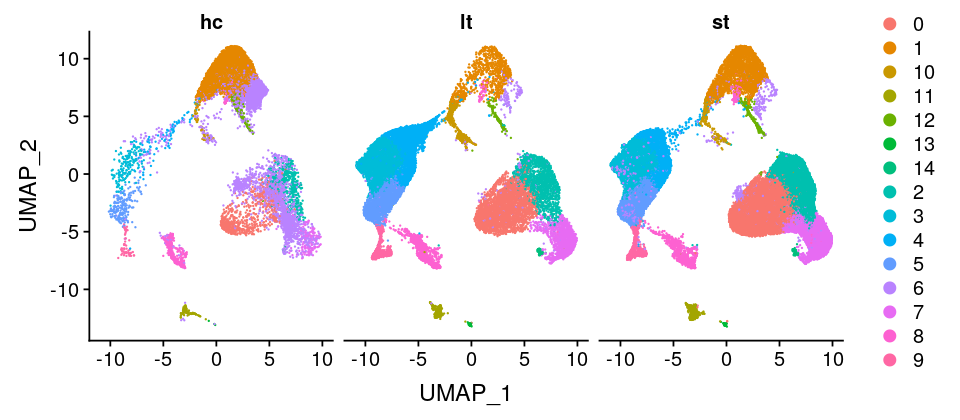
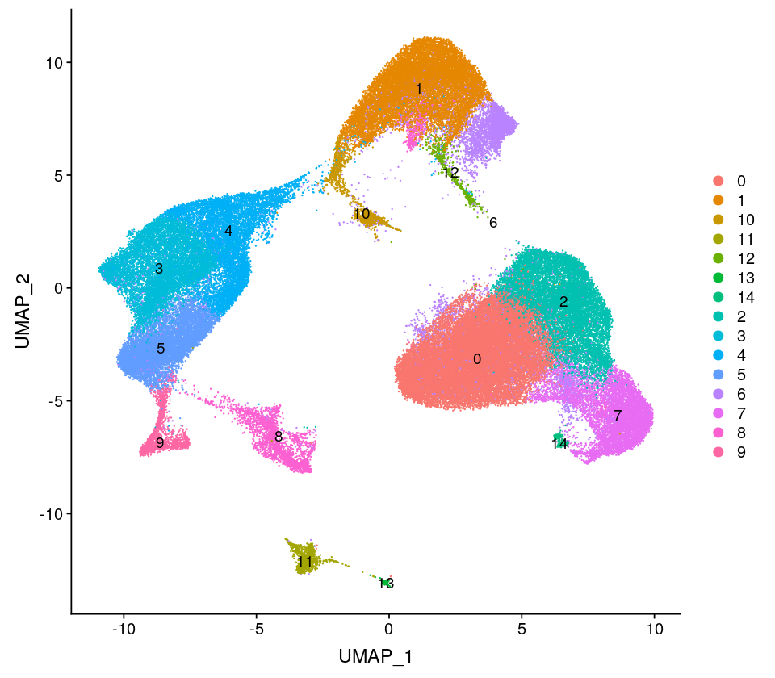
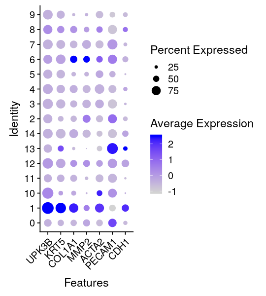
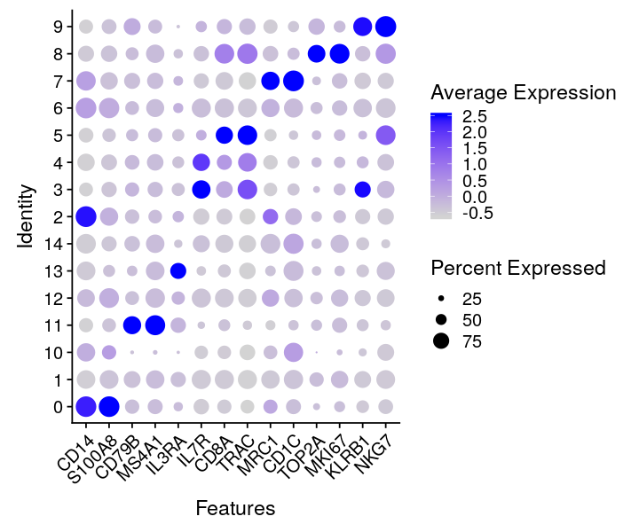
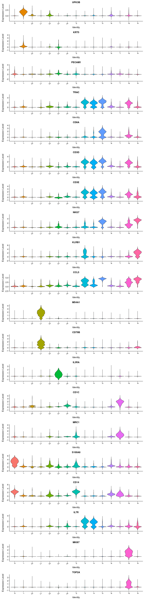

```R
#devtools::install_github('satijalab/seurat-data'
library(Seurat)
library(dplyr)
library(ggplot2)
library(cowplot)
```

    Warning message in system2(command = python, args = paste0("\"", config_script, :
    “running command ''/usr/bin/python3' "/home/zhoujj/R/x86_64-pc-linux-gnu-library/3.5/reticulate/config/config.py"' had status 1”
    Attaching package: ‘dplyr’
    
    The following objects are masked from ‘package:stats’:
    
        filter, lag
    
    The following objects are masked from ‘package:base’:
    
        intersect, setdiff, setequal, union
    
    
    Attaching package: ‘cowplot’
    
    The following object is masked from ‘package:ggplot2’:
    
        ggsave
    


```R
pd.integrated = readRDS(file = "./pd.merged.v2.rds")
```


```R
pd.integrated@version
```


    [1] ‘3.0.1’


```R
options(repr.plot.width=8, repr.plot.height=3.5)
DimPlot(object = pd.integrated, reduction = "umap", split.by = "group")
```





```R
options(repr.plot.width=8, repr.plot.height=7)
DimPlot(object = pd.integrated, reduction = "umap",label = TRUE)
```

    Warning message:
    “Using `as.character()` on a quosure is deprecated as of rlang 0.3.0.
    Please use `as_label()` or `as_name()` instead.
    This warning is displayed once per session.”





```R
options(repr.plot.width=4.5, repr.plot.height=5)
#pdf("marker.dotplot1.pdf", 4.5, 5)
DotPlot(object = pd.integrated, features = c("CDH1","PECAM1", # Mesoothelial cell
                                             "ACTA2", # Myofibroblast
                                             "MMP2","COL1A1", # Fibroblast
                                             "KRT5",'UPK3B' # Mesothelial cell
                                            ))+ RotatedAxis()
#dev.off()
#plot_grid(VlnPlot(object=pd.integrated, features= 'COL1A1'), VlnPlot(object=pd.integrated, features = 'COL4A1'), ncol=2)
```





```R
options(repr.plot.width=6, repr.plot.height=5)
#pdf("marker.dotplot2.pdf", 6, 5)
DotPlot(object=pd.integrated, features= c("NKG7","KLRB1", # NK T cell
                                          "MKI67","TOP2A", # T helper cell
                                          "CD1C","MRC1", # cDC2
                                          "TRAC","CD8A", # T cell
                                          "IL7R", # naive T cell
                                          "IL3RA", # pDCs, but it's similar with Mesodothelial cell
                                          "MS4A1", "CD79B", # B cell
                                          "S100A8","CD14"))+ RotatedAxis() # monocy
#dev.off()
```





```R
#pdf("marker.vlnplot.pdf", 12, 50)
options(repr.plot.width=12, repr.plot.height=50)
VlnPlot(object=pd.integrated, features= c('UPK3B',"KRT5","PECAM1", # mesothelial
                                          "TRAC","CD8A", # T cell
                                          "CD3D","CD3E", "NKG7","KLRB1","CCL5", # NK T cell
                                          "MS4A1", "CD79B", # B cell
                                          "IL3RA", # pDC
                                          "CD1C","MRC1", # cDC2
                                          "S100A8","CD14", # monocy
                                          "IL7R", # naive T cell
                                          "MKI67","TOP2A" ), pt.size=0, ncol=1)
#dev.off()
```





```R

```
